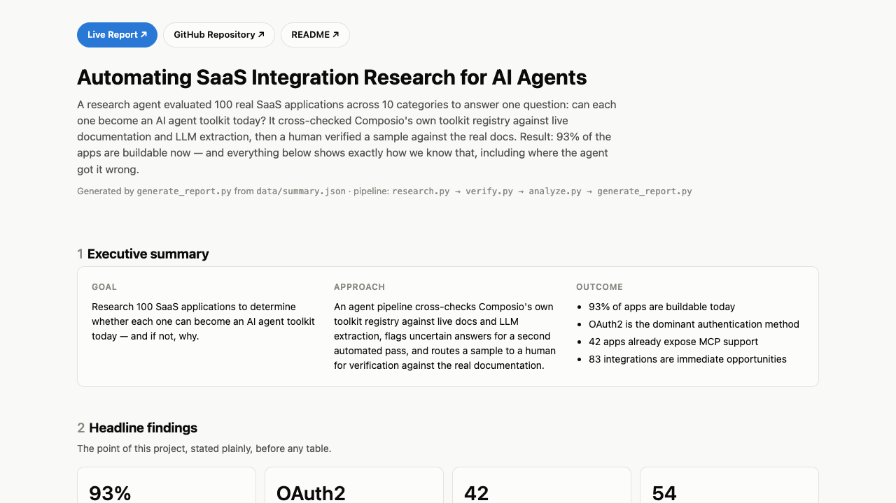
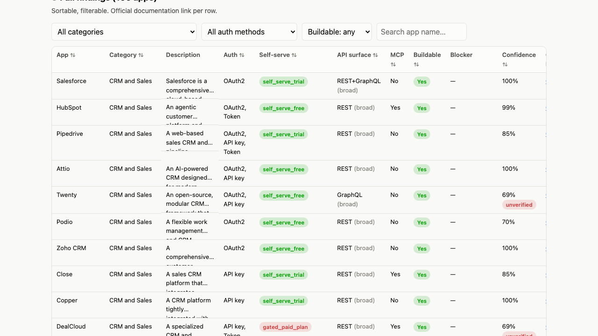

# integration-intelligence

An AI-assisted Product Operations workflow that researches 100 SaaS applications and answers a single question:

> **Can this application be turned into an AI agent toolkit today — and if not, what is blocking it?**

Built as the take-home assignment for the **Composio AI Product Ops Intern** role. The project combines
automated documentation research, structured extraction, confidence scoring, browser-based verification,
and human review to produce a single interactive report summarizing both the findings and the research
process itself.

The primary deliverable is [`report/index.html`](report/index.html).

## Links

- 🌐 [Live Report](https://vighnesh-m-s.github.io/integration-intelligence/report/index.html)
- 💻 [GitHub Repository](https://github.com/Vighnesh-M-S/integration-intelligence)

## Preview

### Dashboard



### Findings



## Key findings

From the final dataset (100 apps, 22 human-graded):

- **93%** of applications are immediately buildable for AI agents.
- **OAuth2** is the dominant authentication method (58 of 100 apps).
- **42** applications already expose MCP support.
- **83** integrations are immediate opportunities — self-serve credentials, no relationship required.
- The primary blocker, when an app isn't buildable, is the **absence of a public API** — not pricing or
  partnership gating.
- Verification loop accuracy on the human-graded sample: **67% first-pass → 65% final** — reported flat,
  honestly, with the reason explained in the report (exact-string scoring on auth terminology, not a
  reasoning failure — see the report's "Human-in-the-Loop Validation" section).

See the [interactive report](https://vighnesh-m-s.github.io/integration-intelligence/report/index.html)
for the full breakdown, charts, and per-app evidence.

## What it does

For each of the 100 apps in `data/apps.csv`:

1. **Checks Composio's own toolkit registry** (`composio.toolkits.get()`) —
   if Composio has already built this integration, that's an authoritative
   ground truth for auth scheme, category, and API breadth. This is the
   "use Composio's own SDK" part of the assignment, used for real signal,
   not just to say it was used.
2. **Fetches the app's public docs page** and asks an LLM (Gemini) to extract
   category, auth method(s), self-serve vs. gated, API surface, MCP status,
   buildability verdict, and blocker — as structured JSON.
3. **Scores a confidence** for the record based on whether the docs fetch
   actually returned usable text and whether the Composio registry and the
   LLM's extraction agree.
4. Records below the confidence threshold get a **second, independent check**
   in `verify.py`: a real Playwright-rendered browser fetch (catches
   JS-rendered docs the plain `requests` fetch in step 2 missed) plus another
   LLM pass, diffed against the original.
5. A **human-graded sample** (`data/human_review_sample.csv`, 22 apps: 12 the
   agent was unsure about + 10 it was confident about as a control group) is
   where a person — not the agent — validates the sampled applications against
   the official documentation using `human_verify.py`, a small interactive
   CLI: it shows the agent's answer per app, offers to open the real docs
   page in your browser, asks y/n per field (typing the correction if "n"),
   and writes `human_*` back into the CSV after every app so nothing is lost
   if you stop partway. This is what makes the accuracy numbers in the report
   real instead of the agent grading its own homework.
6. `analyze.py` mines patterns across all 100 (auth distribution, self-serve
   vs. gated, common blockers, MCP coverage, easy wins vs. needs-outreach) and
   computes first-pass vs. post-verification accuracy from the human sample.
7. `generate_report.py` renders everything into one static `report/index.html`.

## Architecture

```
                        apps.csv (100 apps)
                               │
                               ▼
                         Research Agent
                               │
              ┌────────────────┴────────────────┐
              ▼                                  ▼
    Composio Registry                  Official Documentation
   (composio.toolkits.get)              (requests + BeautifulSoup)
              │                                  │
              └────────────────┬─────────────────┘
                               ▼
                    Structured Extraction (LLM)
                               │
                               ▼
                      Confidence Scoring
                     (source agreement +
                      fetch success, not
                      the model's self-rating)
                               │
                       Low confidence?
                     ┌─────────┴─────────┐
                    Yes                  No
                     │                    │
                     ▼                    │
          Browser Verification            │
        (Playwright re-fetch +            │
           2nd LLM pass)                  │
                     │                    │
                     └─────────┬──────────┘
                               ▼
                     Human Validation
                (22-app graded sample,
              corrections written back
                    into the dataset)
                               │
                               ▼
                      Pattern Analysis
                               │
                               ▼
                    Interactive Report
```

## Design decisions

The workflow intentionally prioritizes correctness and explainability over engineering complexity. The
assignment covers 100 applications, which makes throughput a secondary concern compared to data quality.

Instead of building a distributed pipeline, the project focuses on:

- reproducible research (each stage re-runnable independently, skips what's already done)
- evidence-backed extraction (every field traces back to a docs URL or Composio's own registry)
- human verification (the agent never grades its own homework)
- clear reporting (patterns and honest misses, not just a raw table)

This keeps the system easy to inspect and debug while still automating the majority of the work. No worker
pools, no queues, no orchestration framework — a sequential script pipeline is the right size for 100 apps.

## Pipeline (script execution order)

```
data/apps.csv
   │
   ▼
research.py        Composio registry lookup + docs fetch + LLM extraction + confidence score
   │
   ▼
verify.py           low-confidence apps only → browser re-fetch + 2nd LLM pass
   │
   ▼
data/processed/*.json, data/processed/verification.json
   │
   ▼
analyze.py --sample generates data/human_review_sample.csv  ← human grades this via human_verify.py
analyze.py           patterns + accuracy → data/summary.json
   │
   ▼
generate_report.py  → report/index.html
```

## How to run

Uses the existing Python environment at `~/Downloads/gst` (no new venv
created). Install the extra packages this project needs into it, then run
each stage in order:

```bash
~/Downloads/gst/bin/pip install -r requirements.txt
~/Downloads/gst/bin/playwright install chromium   # one-time, for verify.py

cp .env.example .env
# fill in COMPOSIO_API_KEY and GOOGLE_API_KEY in .env (GOOGLE_API_KEY is free — get one at aistudio.google.com)

~/Downloads/gst/bin/python research.py
~/Downloads/gst/bin/python verify.py
~/Downloads/gst/bin/python analyze.py --sample     # writes data/human_review_sample.csv
~/Downloads/gst/bin/python human_verify.py         # interactive: grade the sample against real docs
~/Downloads/gst/bin/python analyze.py              # writes data/summary.json (patterns + accuracy)
~/Downloads/gst/bin/python generate_report.py      # writes report/index.html
```

`research.py` and `verify.py` skip apps that already have a processed record,
so re-running after fixing something only touches what's missing.

## Data model

Each app's record in `data/processed/<id>_<slug>.json`:

```
name, category, description, authentication[], self_serve, api_surface,
api_breadth, mcp, buildable, blocker, evidence_urls[], notes,
confidence, needs_verification, composio_registry_match, source
```

## Limitations

- Docs-site fetching is best-effort: bot-walled, login-gated, or heavily
  JS-rendered docs sometimes return thin or no text even after the browser
  re-check, and those records are flagged with lower confidence rather than
  presented as verified fact — see the report's "Limitations & future improvements" section.
- Confidence scoring is a simple heuristic (source agreement + fetch success +
  model self-rating), not a calibrated statistical model.
- The Composio registry lookup tries a small number of slug variants per app
  name; some apps that do exist in Composio's catalog under a different slug
  will be missed and fall back to the docs-only path.

## Future improvements

- **A working internal tool, not just a script pipeline** — a small web UI to edit `apps.csv`, trigger
  each pipeline stage, and do manual verification, all from a browser instead of the command line. Right
  now everything runs from the CLI; the natural next step is making every stage click-to-run with live
  status, so a non-technical teammate could add an app and re-run research without touching Python.
- **Parallel execution** — sequential is easy to debug and fast enough at
  100 apps; not worth the complexity here.
- **Multi-source consensus beyond 2 sources** — Composio registry + docs
  fetch + browser re-check already gives 3 independent signals for the apps
  that need it; a 4th source (e.g. a second LLM provider) would mostly
  duplicate whichever of the first two already has more text to work with.
- **Scheduled re-runs / continuous monitoring** — this is a point-in-time
  research snapshot for a one-off assignment, not a monitored production
  dataset. If this became a real internal tool, re-running on a schedule and
  diffing against the previous snapshot would be the natural next step.
- **Incremental updates on doc changes** — same reasoning; no webhook or
  changelog-watching exists for the 100 docs sites involved.

## Assignment scope

This project intentionally optimizes for correctness, verification, and communication rather than
infrastructure complexity. Within the assignment's stated 6–8 hour scope, the goal was to automate
repetitive research, verify uncertain outputs, extract actionable product insights, and communicate those
findings clearly — not to build a production system for a one-off, 100-app research task.
